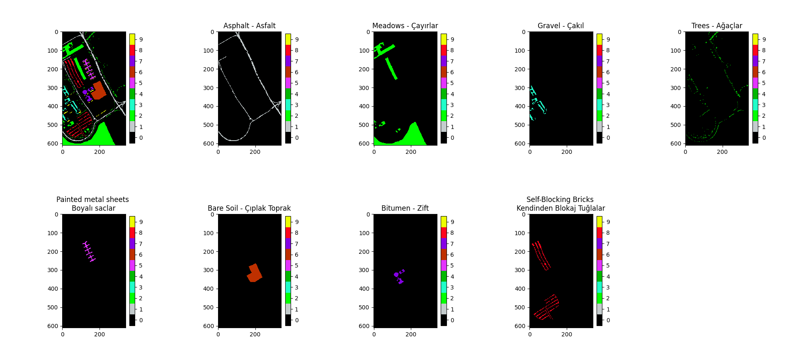
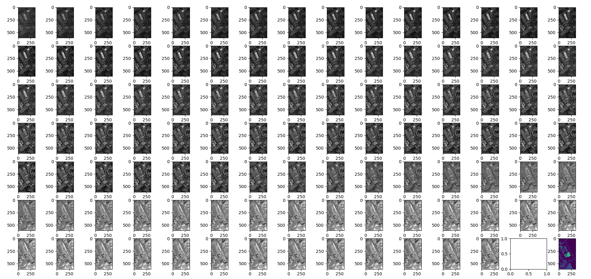
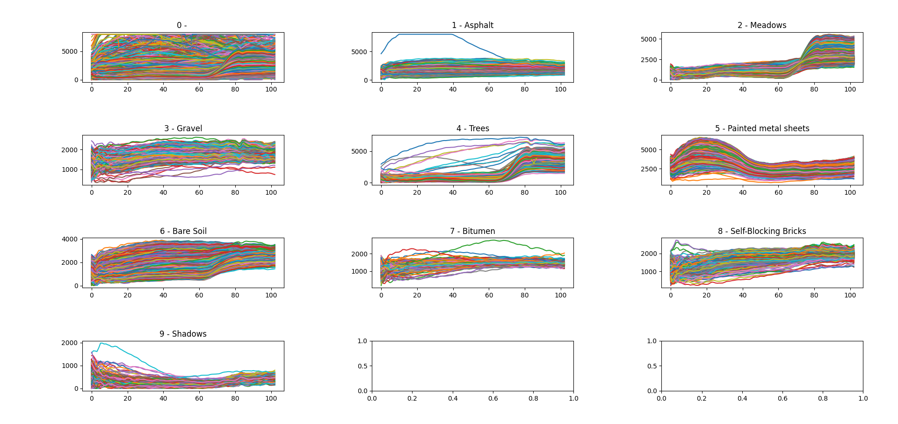
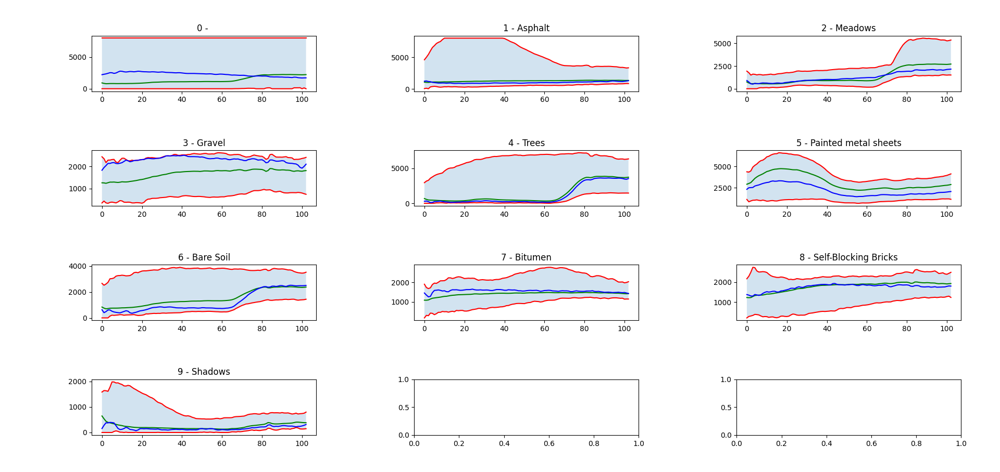

Ders projesi kapsamında:
- [x] ROSIS Pavia University hiperspektral verisi tedarik edilmeli
- [x] Yer doğrusu haritası kullanarak, etiketli olan piksel vektörlerinin her sınıftan %5'i eğitim verisi olarak alınmalı (geri kalan %95 test verisi olacak)
- [x] RBF çekirdekli SVM'in eğitimi için gerekli olan iki parametre (C ve sigma) eğitim verisi üzerinden 10 katlı çapraz doğrulama ile belirlenmeli
- [x] RBF çekirdekli SVM sınıflandırıcı yöntemi, belirlenen parametreleri kullanarak, eğitim verisi üzerinde eğitilmeli
- [ ] Eğitilen sınıflandırıcı tüm veriye uygulanarak görsel sonuç elde edilmeli
- [ ] Sınıflandırıcının test verisine uygulanması ile **overall accuracy**, **average accuracy** ve **kappa** cinsinden sayısal sonuçlar elde edilmeli
- [ ] Ek olarak, eğitim verisi oranının başarıma etkisini ve çapraz doğrulamanın başarıma etkisini analiz edebilirsiniz.
- [ ] Teslim edilecek dosyalar: Görsel ve sayısal sonuçlarızı sunan kısa rapor ve tek adımda çalıştırmaya hazır halde hazırlanmış kodlar, alp.erturk@kocaeli.edu.tr adresine
- [ ] Teslim tarihi: En geç 28.05.2021 23:59






```bash
pip install -r require.txt
```


```bash
python main.py
```


```
[(0, 164624), (1, 6631), (2, 18649), (3, 2099), (4, 3064), (5, 1345), (6, 5029), (7, 1330), (8, 3682), (9, 947)]
```

Class | Count
------|------
0 | 164624
1 | 6631
2 | 18649
3 | 2099
4 | 3064 
5 | 1345| 
6 | 5029 
7 | 1330 
8 | 3682 
9 | 947


```
hyperspectral image: 610x340x103
ground truth image:  610x340

data = {
    0: [ [...], [...] ]
    1: [ [...], [...] ]
    2: [ [...], [...] ]
    ...
}
```







```python


```


